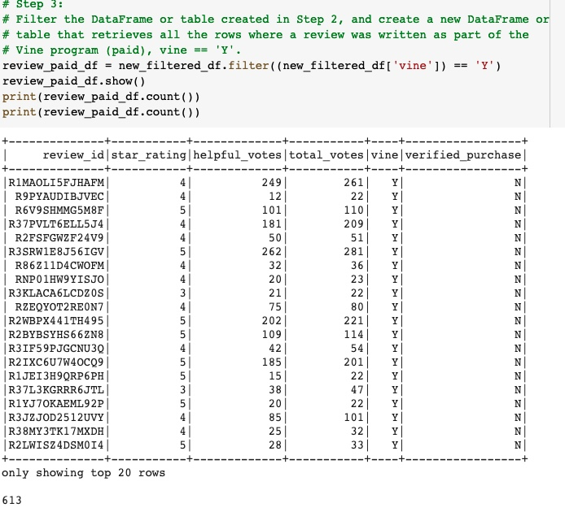
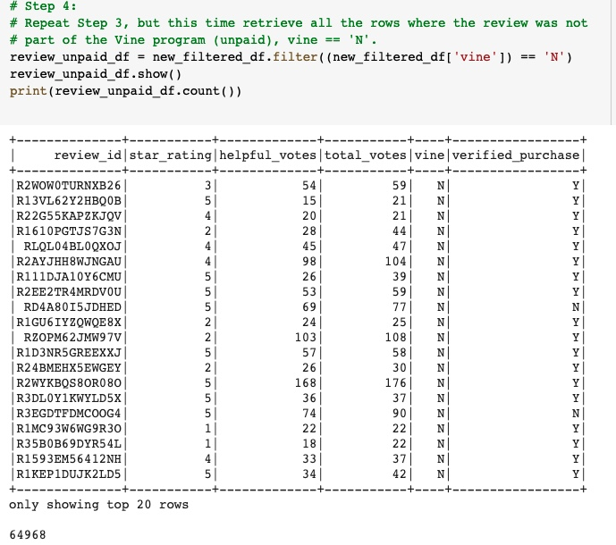
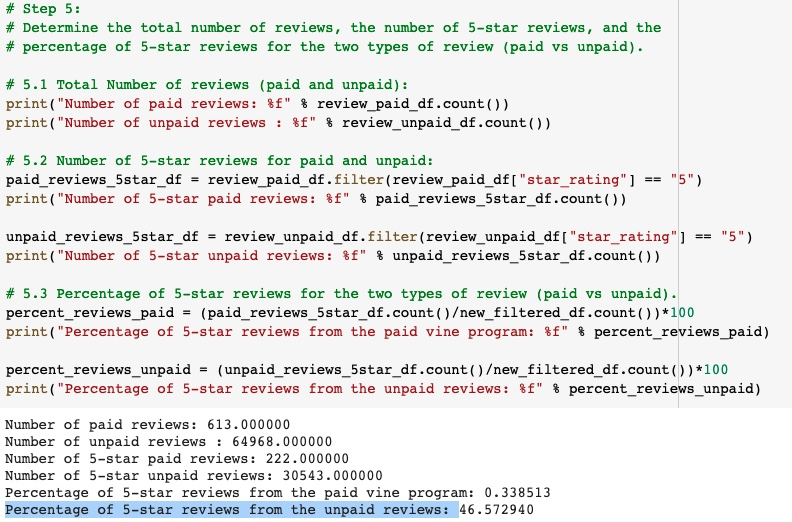

# Amazon_Vine_Analysis

## Overview of the Analysis

The following analysis was performed on a dataset of Amazon reviews about wireles products written by members of the paid Amazon Vine program. The Amazon Vine program is a service that allows manufacturers and publishers to receive reviews for their products. We have used PySpark and google colab as our main tools to parse the data. Additionally we have used Amazon Web Services (AWS) to host our online server and pgadmin to hold our database.  The main purpose of this analysis was to determine if there is any bias toward favorable reviews written by the paid Vine members. 

Amazon wireles reviews: [link to dataset](https://s3.amazonaws.com/amazon-reviews-pds/tsv/amazon_reviews_us_Wireless_v1_00.tsv.gz)

## Resuls

 **How many Vine reviews and non-Vine reviews were there?**

 After tiltering our dataframe and retrieving the results, we have found out that there were:
 * 613 Vine reviews.
 * 64,968 non-Vine reviews.

**How many Vine reviews were 5 stars? How many non-Vine reviews were 5 stars?**

* Number of 5-star paid reviews: 222
* Number of 5-star unpaid reviews: 30543

**What percentage of Vine reviews were 5 stars? What percentage of non-Vine reviews were 5 stars?**

* Percentage of 5-star reviews from the paid vine program: 34%.
* Percentage of 5-star reviews from the unpaid reviews: 47%.

## Summary

Based on our results, there was a 34% 5-star rating from the paid vine program vs 47% 5-star rating from the unpaid reviews,
the difference is only 13%, which we could assume is not significantly diffent and therefore it would not skew our bias our results positiviley reviews in the Vine program. 

## Additional Analysis

We have data from verified purchases. We can determine the rating provided by verified buyers versus non-verified buyers and see if verified users tend to rate more possitively or negatively and this affects our dataset.  

